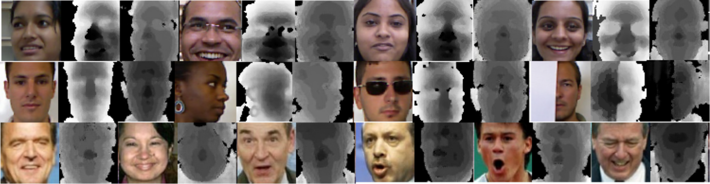

# Teacher-student GAN (TS-GAN)
Teacher-student generative adversarial network (TS-GAN), to generate depth images from a single RGB image to boost the recognition accuracy of face recognition (FR) systems. It has been implemented in Tensorflow-2.2.\
The related article can be found at [arXiv.org](https://arxiv.org/abs/2104.02424)
#### Authors: Hardik Uppal, Alireza Sepas-Moghaddam, Michael Greenspan, Ali Etemad.

## Architecture

## Results

The first two rows show samples of the RGB-D datasets (IIIT-D and EURECOM KinectFaceDb). The first column shows RGB images, the second column shows the ground truth depth, and the third column shows the hallucinated depth. In the third row LFW samples are presented where the first column shows the RGB images while the second column shows the hallucinated depth.
## Datasets
* EURECOM KinectFaceDb
* CurtinFaces
* IIIT-D
* LFW

## Requirements
* python 3.6
* tensorflow 2.2
* opencv
* numpy 
* tqdm
* pickle
* oyaml

## Acknowledgments
Some parts of our code has been borrowed from [CycleGAN TF v2](https://github.com/LynnHo/CycleGAN-Tensorflow-2).

